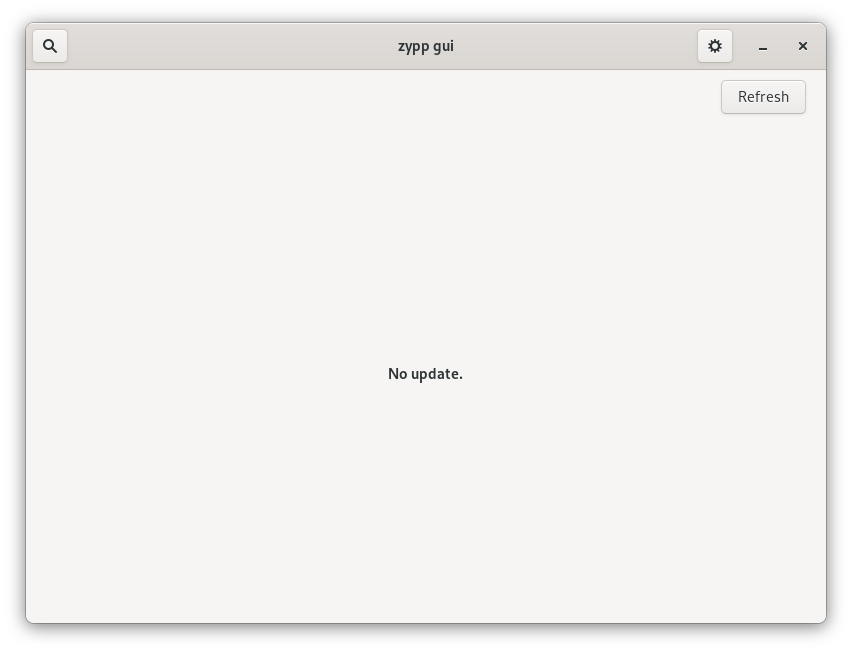
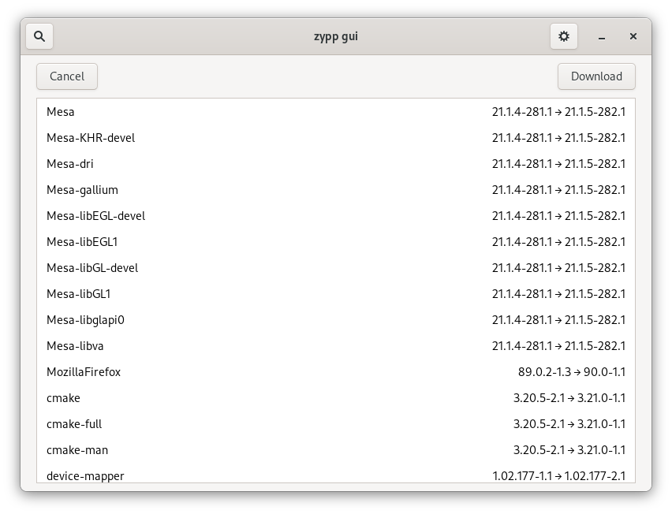
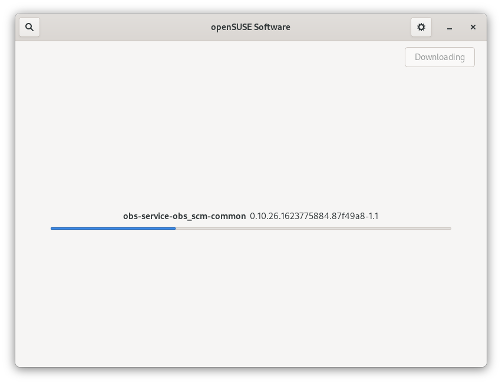
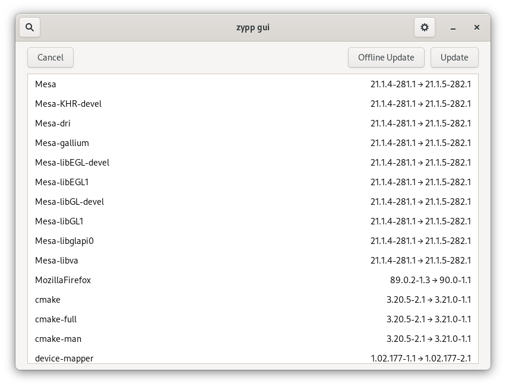
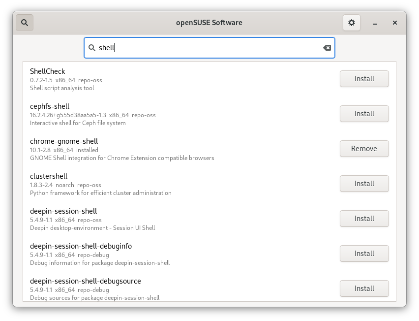
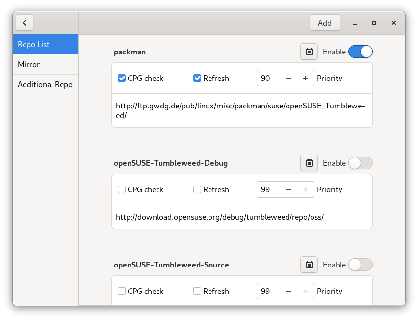

# openSUSE software

It's a GUI applicaion working on openSUSE distro. Application runs as a deamon to monitor the system update. When there is new update, application can update the system. Application can search, install and remove the package, change the settings of repos. It achieves some functions of command `zypper`.

## Targets:
- [x] Refresh the repos, download the packages, install the update.
- [x] Search, install and remove the package.
- [x] Offline update.
- [ ] Add and remove repos.
- [x] Modify the repos.
- [ ] Add mirror repos.
- [ ] Monitor the new release and update to the new release.

## Screenshot








## How to build:

#### meson
1. Install dependences:
```
zypper in meson gcc cargo glib2-devel gtk3-devel systemd-devel libpackagekit-glib2-devel polkit-devel libhandy-devel
```
2. Compile:
```
meson --prefix /usr _builddir
meson compile -C _builddir
```
3. Install:
```
meson install -C _builddir
```

#### Open Build Service
[OBS Link](https://build.opensuse.org/package/show/home:xiaoguang_wang:branches:GNOME:Factory/openSUSE-software)
